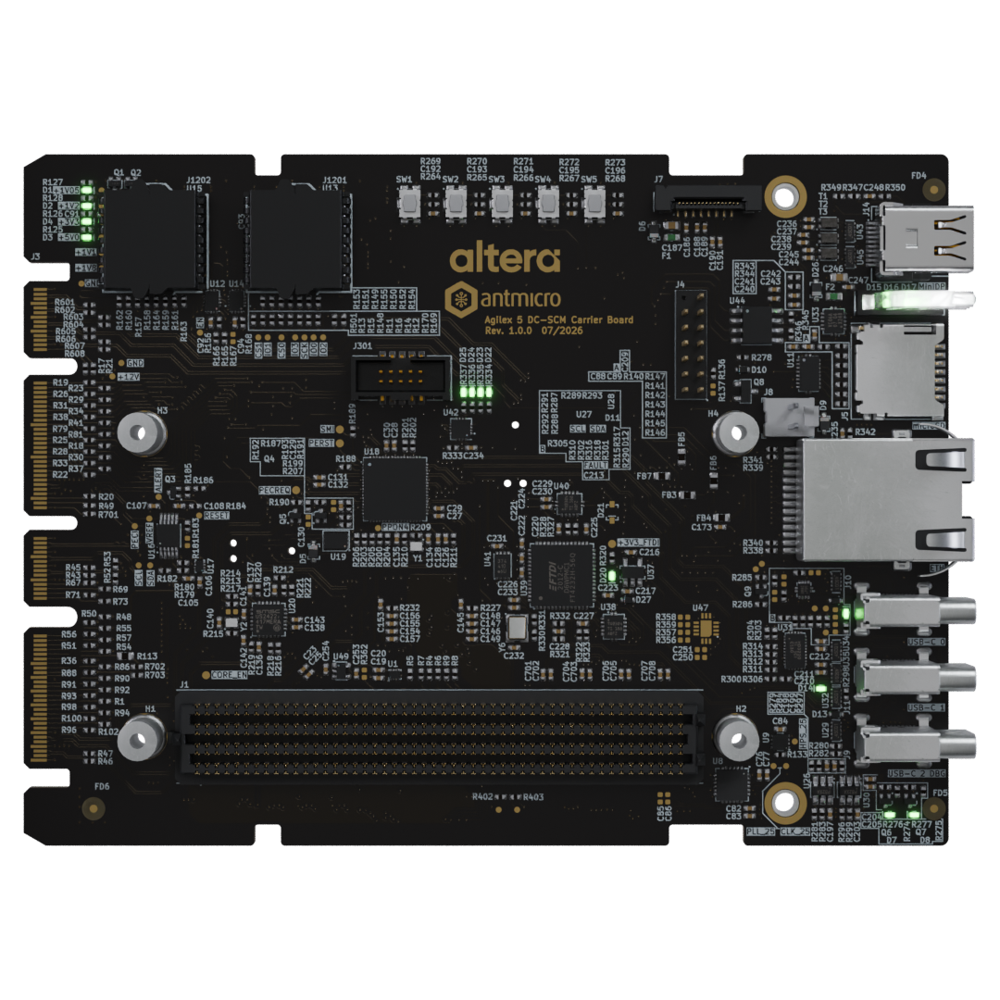

# applications.fpga.soc.agilex5e-modular-dcscm-board

## Overview

This repository contains design files for a DC-SCM compliant Agilex 5 Modular DC-SCM Carrier Board that supports the [Critical Link MitySOM-A5E Mini](https://www.criticallink.com/product/mitysom-a5e-mini/) System on Module based on the [Altera Agilex A5E](https://www.altera.com/products/fpga/agilex/5) SoC family. The DC-SCM follows the interface and mechanical outline described in the 2.1 revision of the [DC-SCM standard](https://drive.google.com/file/d/1-SdSQvSWy5pNN_kBiyztblxE4jdyUe9W/view) specified by the Open Compute Project community.

The PCB design files were prepared in [KiCad](https://www.kicad.org/) 10.x

## Project structure

The main directory contains KiCad PCB project files and a README.
The remaining files are stored in the following directories:
* `assets` contains graphics for this README
